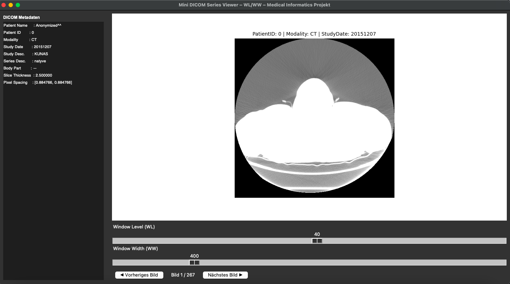

1 - Mini DICOM Series Viewer (Mini PACS Viewer)
Medizinische Informatik – Python Projekt

Dieses Projekt ist ein eigenständig entwickelter DICOM Viewer, der grundlegende Funktionen eines PACS-Systems simuliert. Er wurde im Rahmen meiner Vertiefung in der Medizinischen Informatik erstellt und dient dem praktischen Verständnis von radiologischen Workflows, Bildserien (CT/MR) und dem DICOM-Standard.

 Hauptfunktionen

—Laden einzelner DICOM-Dateien
Der Viewer kann einzelne DICOM-Bilder (z. B. CR, XC, OT) laden und deren Metadaten anzeigen.

—Automatisches Erkennen kompletter CT-/MR-Serien
- Erkennung anhand von **StudyInstanceUID** und **SeriesInstanceUID**
- Sortierung mit **InstanceNumber** oder **ImagePositionPatient**
- Typischer Workflow wie in PACS-Systemen

—Navigation zwischen Bildern
- Buttons: **Vorheriges Bild / Nächstes Bild**
- Tastatur: **← → Pfeiltasten**
- Anzeige der aktuellen Slice-Position im Format *Bild X / N*

—Window Level & Window Width (WL/WW)
Interaktive Anpassung von:
- **Kontrast**
- **Helligkeit**

Mittels zwei Slidern — wie in professionellen PACS-Viewern.

—Anzeige medizinischer Metadaten
Anzeige relevanter DICOM-Felder, z. B.:
- PatientID  
- StudyDate  
- Modality  
- SliceThickness  
- PixelSpacing  
- SeriesDescription  

 3. Technische Umsetzung

3.1Technologien:
- Python 3 
- pydicom**
- Tkinter (GUI)
- matplotlib
- NumPy

3.2 Architektur:
- Laden des ersten DICOM-Bildes  
- Scannen des Verzeichnisses nach zugehörigen Serien  
- Sortierung der Series  
- Aktualisierung der GUI bei Navigation oder WL/WW-Änderung  
- Rendering des Bildes im matplotlib-Canvas  

4. Projektstruktur
medical_dicom_viewer/
│
├── dicom_viewer_series.py # Hauptprogramm (CT/MR Series Viewer)
├── dicom_viewer.py # Einfache Version (Optional)
├── README.md # Projektdokumentation
└── dicom_samples/ # Beispiel-DICOMs (nicht im Repo!)

⚠️ Aus Datenschutzgründen sollten keine echten Patientendaten hochgeladen werden.

5. Screenshots

Nachfolgend ein Beispielbild der grafischen Benutzeroberfläche des Mini DICOM Series Viewers.  
Es zeigt die wichtigsten Komponenten eines PACS-ähnlichen Workflows:

- Anzeige eines CT-/MR-Slices  
- Metadatenbereich (PatientID, Modality, StudyDate usw.)  
- Window Level (WL) und Window Width (WW) Steuerung  
- Navigation durch die Bildserie (Vorheriges/Nächstes Bild)  

### Beispielansicht

6. Lernziele

Durch dieses Projekt wurden folgende Kompetenzen ausgebaut:

- Verständnis des (DICOM-Standards) und radiologischer Workflows  
- Arbeiten mit (DICOM-Metadaten) und Bildserien  
- Implementierung von (Windowing-Algorithmen)  
- praktische GUI-Entwicklung in Python  
- Algorithmische Sortierung von CT-/MR-Slices  
- Anwendung medizinisch relevanter Konzepte wie  
(Slice Thickness), (Pixel Spacing), (Instance Number) 

7. Relevanz für die medizinische Informatik

Das Projekt simuliert wesentliche Funktionen eines PACS-Systems und demonstriert Wissen in:

- Medical Imaging  
- Health IT / Radiologie-Systeme  
- Datenvisualisierung  
- Bildverarbeitung  
- Softwareentwicklung im Gesundheitswesen  

Es eignet sich ideal als Portfolio-Projekt für:

- Werkstudent/in Gesundheit IT  
- PACS/RIS Support  
- Medical Software Development  
- Radiologie-Informatik  

8. Kontakt
Bei Interesse an meinem Projekt oder meiner Arbeit im Bereich der medizinischen Informatik freue ich mich über eine Nachricht.

